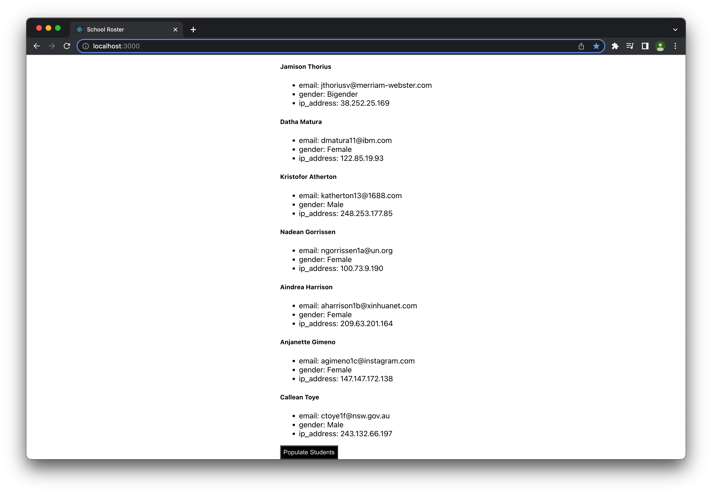

# Student Roster

A REACT app that populates a student roster.

Technology used: REACT, HTML, CSS

Home Page

Click populate students

# Inspiration
This is part of a group project where we had to create a REACT app that connects to an API point that grabs student data and outputs it on a webpage.